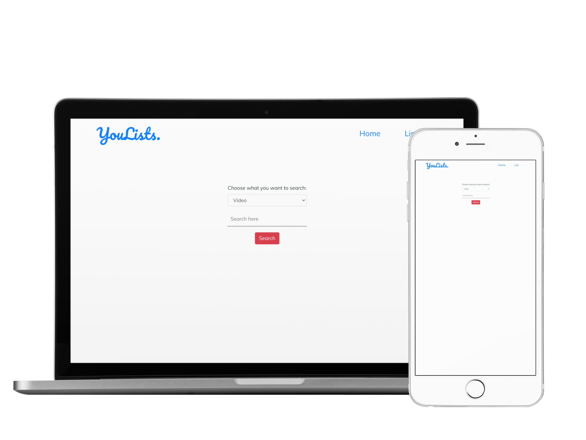

## YouList 📺 📝

Being an avid Youtube fan, I HAD to build a project using the <b>youtube-data-api</b>. Youtube is my first destination when it comes to learning new stuff 😉 and is my go to destination
for seeking inspiration from other tech, lifestyle, travel youtube creators.

### Why I built this?
I learn alot from Youtube but often lose track of the videos(the videos I haven't completed watching yet, the ones I am too watch soon etc.) Moreover at times, I get distracted from my
goal of watching a particular video due to the recommendations. 😅 This was the major inspiration for me behind building this project! 
Video, Channel information can directly searched using the API and moreover, a list is maintained of all the videos watched, yet to watch and watching right now.
More functionalities coming soon!😃

### Tools Used
❇️ HTML 
❇️ CSS 
❇️ Bootstrap 
❇️ Javascript 
❇️ Django (Python) 
❇️ ChartJs 

### Functionalities 
<small>(☑️:<b>done</b>, 🔴:<b>not done yet</b>)</small>  
☑️ Video search results 
☑️ Channel search results 
☑️ ChartJs (pie chart) for showing like/dislike ratio 
☑️ Crud functionality of list 
🔴 Pagination of the list 
🔴 Live search of the list 
🔴 Add watching, not watching, need to watch checkbox fields 
🔴 Emoji template 
🔴 Add extra set of tags to a video task 
🔴 Playlist search results 

### A Few Sample Images

